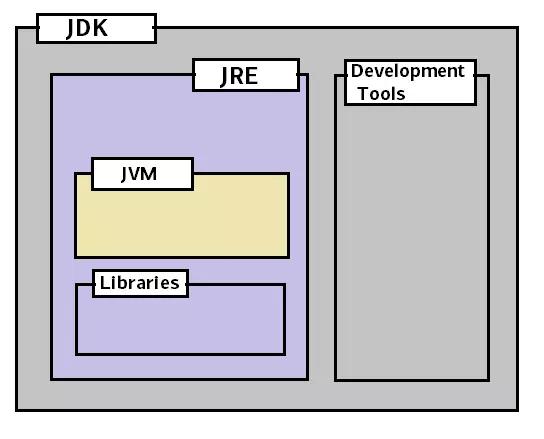

**-- JWM là chương trình chuẩn bị môi trường thực thi cho ứng dụng Java. Có thể xem nó như một máy ảo (trừu tượng) để chương trình chạy bên trong nó.**

JWM có 4 chức năng:

* Tải bytecode từ file `.class` lên bộ nhớ (class loader)
* Xác minh bytecode hợp lệ (verifier)
* Thông dịch bytecode thành mã máy (interpreter) và thực thi
* Cung cấp môi trường thực thi

-- **Java Runtime Environment**

JRE gồm JVM, các thư viện chạy và các chương trình hỗ trợ chạy ứng dụng java. Có thể so sánh JRE với .NET framework.

JRE dành cho user muốn chạy các app viết bằng java, nếu không có thì không chạy được.

-- **Java Development Kit**

JDK bao gồm JRE và các công cụ khác để hỗ trợ lập trình java (compiler, interpreter, docs,...). Khác với JRE là dành cho user, JDK dành cho lập trình viên, để viết ra các chương trình java.

**-- Garbage Collection**

GC là một thành phần của JVM, có tác dụng kiểm soát và thu gom các vùng nhớ không dùng nữa (không còn được tham chiếu đến) để trả lại cho HĐH, giúp tiết kiệm bộ nhớ

---

**Những kiểu dữ liệu nguyên thủy (primitive types) trong java gồm**

|  Type  | Size    |
| :-----: | ------- |
| boolean | 1 bit   |
|  char  | 2 bytes |
|  byte  | 1 bytes |
|  short  | 2 bytes |
|   int   | 4 bytes |
|  long  | 8 bytes |
|  float  | 4 bytes |
| double | 8 bytes |

https://viblo.asia/p/java-co-ban-phan-2-maGK7J3M5j2#_2-operators-2

==> Tim hieu ky hon ve bo nho Heap va Stack, String pool, Intger pool, ...

assertion

STACK                          HEAP (String Pool + Other Objects)

    ──────────────────              ──────────────────────────────────────────────
    | s1 ─────────────┐             |             "Hello" (String Literal)         |
    |                │────────────▶|     [String object at address 0x100]          |
    ├────────────────┤             └───────────────────────────────────────────────
    | s2 ─────────────┘             ^
    |                ┐             |
    ├────────────────│─────────────┘
    | s3 ─────────────┐             ┌──────────────────────────────────────────────┐
    |                │────────────▶|   new String("Hello") => [String at 0x200]   |
     ──────────────────            └───────────────────────────────────────────────
